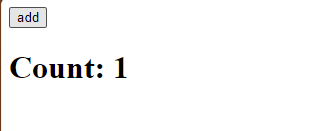

# Ryact

simplified JSX renderer based on react (for study purposes,also I am calling it Ryact)

# Features of "Ryact"

1. `createElement()`, `createTextElement()`
2. [component Reconciliation](https://legacy.reactjs.org/docs/reconciliation.html) (add or update components to DOM)
3. [Fiber](https://github.com/acdlite/react-fiber-architecture) (used to chunk rendering components and unblock main JS thread)
4. [Functional Components](https://legacy.reactjs.org/docs/components-and-props.html#:~:text=on%20the%20screen.-,Function,-and%20Class%20Components)
5. [Hooks](https://legacy.reactjs.org/docs/hooks-rules.html#gatsby-focus-wrapper)

# The testing application

The application is a counter app that has a button.

Everytime you click the "add" button, it will increment the counter.

It was implemented using _Functional Components_ and an _useState_ hook

# To test changes

1. `npm i -g live-server` [live-server](https://www.npmjs.com/package/live-server)
2. start the live-server in your terminal: `live-server`
3. open [http://localhost:8080/src/index.html](http://localhost:8080/src/index.html)
4. explore the source code making changes to it
